# Architecture Diagram: Competition Command Tower

Updated: 2026-06-08 KST

## Maestro Case Flowchart

```mermaid
flowchart TD
    %% ---- Entry ----
    trigger(["New competition URL\n(operator or monitor)"])

    %% ---- Stage 1 ----
    s1_robot["Stage 1: Contest Intake\n(UiPath Robot)"]
    s1_exc1{"Fetch failed?"}
    s1_exc2{"Timezone conflict?"}
    s1_exc3{"Rules incomplete?"}
    s1_hold1(["HOLD: INTAKE_FETCH_FAILED\n→ operator alert"])
    s1_hold2(["HOLD: RULES_INCOMPLETE\n→ operator manual review"])
    s1_out["case_record_v1.json\n(deadline · track · assets · credential_refs)"]

    %% ---- Stage 2 ----
    s2_agent["Stage 2: Rule Verification\n(Maestro AI Agent)"]
    s2_stale{"Stale delta > 24 h\nor confidence < 0.5?"}
    s2_urgent{"Deadline < 72 h?"}
    s2_hold(["HOLD: HUMAN_REVIEW_QUEUE\n→ Action Center"])
    s2_out["verified_case_record.json\n(confidence · resolved deadline · priority)"]

    %% ---- Stage 3 HITL ----
    s3_hitl[/"Stage 3: Credential & Access Gate\n(Human Task — Action Center)"/]
    s3_approve{"Operator decision"}
    s3_defer(["DEFER: return date set\n→ case holds"])
    s3_cancel(["CANCEL: case closed\n(ABANDONED)"])
    s3_out["gated_case_record.json\n(credential_map · disabled_integrations)"]

    %% ---- Stage 4 ----
    s4_agent["Stage 4: Work Routing\n(Maestro AI Agent)"]
    s4_empty{"Routing empty?"}
    s4_hold(["HOLD: ROUTING_EMPTY\n→ operator review"])
    s4_out["dispatch_packet_set.json\n(per-task: goal · agent · stop conditions)"]

    %% ---- Stage 5 lanes ----
    s5_codex["Codex CLI\n(code · tests · scripts)"]
    s5_claude["Claude Code\n(architecture · docs · wording)"]
    s5_gemini["Gemini CLI\n(idea generation · alternatives)"]
    s5_robot["UiPath Robot\n(repo ops · release)"]
    s5_cred{"Credential blocked?"}
    s5_safe{"Secret in artifact?"}
    s5_block(["HOLD: CREDENTIAL_BLOCKED\n→ return to Stage 3"])
    s5_quarantine(["QUARANTINE: artifact blocked\n→ agent must fix"])
    s5_out["artifact_manifest.json\n+ AGENT_WORKLOG entries\n+ receipts"]

    %% ---- Stage 6 ----
    s6_audit["Stage 6: Readiness Audit\n(AI Agent + Robot)"]
    s6_secret{"Secret scan fails?"}
    s6_missing{"Critical items missing?"}
    s6_fix(["Return to Stage 5\n(specific tasks)"])
    s6_out["readiness_packet.json\n+ checklist + blockers"]

    %% ---- Stage 7 HITL ----
    s7_hitl[/"Stage 7: Submission Gate\n(Human Task — Action Center)"/]
    s7_decision{"Operator decision"}
    s7_defer(["DEFER: items to fix\n→ case holds"])
    s7_submit["Execute submission:\nrepo push + Devpost form"]
    s7_out(["submission_receipt.json\n(SUBMITTED status · audit trail closed)"])

    %% ---- Flows ----
    trigger --> s1_robot
    s1_robot --> s1_exc1
    s1_exc1 -- yes --> s1_hold1
    s1_exc1 -- no --> s1_exc2
    s1_exc2 -- "flag: DEADLINE_CONSERVATIVE" --> s1_exc3
    s1_exc2 -- no conflict --> s1_exc3
    s1_exc3 -- yes --> s1_hold2
    s1_exc3 -- no --> s1_out

    s1_out --> s2_agent
    s2_agent --> s2_stale
    s2_stale -- yes --> s2_hold
    s2_stale -- no --> s2_urgent
    s2_urgent -- "flag: URGENT" --> s2_out
    s2_urgent -- no --> s2_out

    s2_out --> s3_hitl
    s3_hitl --> s3_approve
    s3_approve -- APPROVE --> s3_out
    s3_approve -- DEFER --> s3_defer
    s3_approve -- CANCEL --> s3_cancel
    s3_approve -- "SKIP_CREDENTIAL\n(partial)" --> s3_out

    s3_out --> s4_agent
    s4_agent --> s4_empty
    s4_empty -- yes --> s4_hold
    s4_empty -- no --> s4_out

    s4_out --> s5_codex & s5_claude & s5_gemini & s5_robot
    s5_codex & s5_claude & s5_gemini & s5_robot --> s5_cred
    s5_cred -- yes --> s5_block
    s5_cred -- no --> s5_safe
    s5_safe -- yes --> s5_quarantine
    s5_safe -- no --> s5_out

    s5_out --> s6_audit
    s6_audit --> s6_secret
    s6_secret -- yes --> s5_quarantine
    s6_secret -- no --> s6_missing
    s6_missing -- yes --> s6_fix
    s6_fix --> s5_codex
    s6_missing -- no --> s6_out

    s6_out --> s7_hitl
    s7_hitl --> s7_decision
    s7_decision -- SUBMIT --> s7_submit
    s7_decision -- DEFER --> s7_defer
    s7_decision -- SKIP_PLATFORM --> s7_submit
    s7_submit --> s7_out

    %% ---- Style ----
    classDef robot fill:#dbeafe,stroke:#3b82f6,color:#1e3a5f
    classDef agent fill:#dcfce7,stroke:#22c55e,color:#14532d
    classDef hitl fill:#fef9c3,stroke:#eab308,color:#713f12
    classDef hold fill:#fee2e2,stroke:#ef4444,color:#7f1d1d
    classDef output fill:#f3f4f6,stroke:#6b7280,color:#111827

    class s1_robot,s5_robot robot
    class s2_agent,s4_agent,s5_codex,s5_claude,s5_gemini,s6_audit agent
    class s3_hitl,s7_hitl hitl
    class s1_hold1,s1_hold2,s2_hold,s3_defer,s3_cancel,s4_hold,s5_block,s5_quarantine,s6_fix,s7_defer hold
    class s1_out,s2_out,s3_out,s4_out,s5_out,s6_out,s7_out output
```



**Legend:**
- Blue nodes: UiPath Robot (Studio Web automation)
- Green nodes: AI Agent (Maestro / Claude Code / Codex / Gemini)
- Yellow nodes: Human-in-the-loop gates (Action Center)
- Red nodes: Hold / exception states
- Grey nodes: Data contracts passed between stages

---

## Component Map

| Component | Stage(s) | UiPath artifact |
|---|---|---|
| UiPath Robot — intake scraper | 1 | Studio Web automation |
| Maestro AI Agent — rule verifier | 2 | Maestro agent definition |
| UiPath Action Center | 3, 7 | Human task form |
| Maestro AI Agent — work router | 4 | Maestro agent definition |
| Claude Code (external coding agent) | 5 | Coding agent via CLI |
| Codex CLI (external coding agent) | 5 | Coding agent via CLI |
| Gemini CLI (external coding agent) | 5 | Coding agent via CLI |
| UiPath Robot — repo and release | 5 | Studio Web automation |
| Maestro AI Agent — audit checker | 6 | Maestro agent definition |
| UiPath Robot — checklist runner | 6 | Studio Web automation |
| UiPath Action Center | 7 | Human task form |
| Automation Cloud data store | All | Credential store + case DB |

---

## Data Flow Summary

```text
[Official contest URL]
  -> Stage 1 (Robot): scrape rules, normalize deadline, detect conflicts
  -> case_record_v1.json
  -> Stage 2 (AI Agent): verify against live page, resolve conflicts, score confidence
  -> verified_case_record.json
  -> Stage 3 (HITL): operator approves credential use and public steps
  -> gated_case_record.json
  -> Stage 4 (AI Agent): decompose into tasks, assign to agent lanes
  -> dispatch_packet_set.json
  -> Stage 5 (Codex / Claude / Gemini / Robot): execute tasks, produce artifacts
  -> artifact_manifest.json + worklog entries
  -> Stage 6 (AI Agent + Robot): audit completeness, run secret scan, check URLs
  -> readiness_packet.json
  -> Stage 7 (HITL): operator approves and submits
  -> submission_receipt.json  [case SUBMITTED]
```

---

## Integration Points

| Integration | Purpose | Credential type |
|---|---|---|
| GitHub (via Robot) | Repo creation, push, release | GitHub token in Automation Cloud Credential Store |
| Devpost (manual or webhook) | Form submission, URL capture | Session cookie (operator action only) |
| Email / Slack alerts | Deadline warnings, gate reminders | SMTP / webhook in Credential Store |
| UiPath Action Center | Human task delivery | Automation Cloud native |
| External AI agents | Builder execution | Local CLI session (operator machine) |

No credentials are stored in this repository. All secrets are referenced by
name in the Automation Cloud Credential Store and loaded at runtime.
